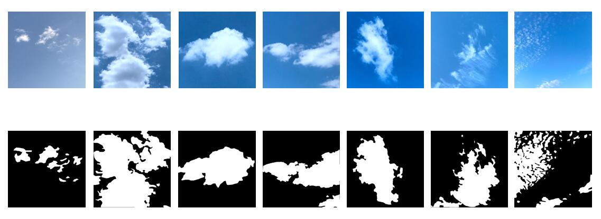

# TJNU-Large-Scale-Cloud-Detection-Database
TJNU Large-Scale Cloud Detection Database (TLCDD) is collected from 2019 to 2021 in nine provinces of China, which includes Tianjin, Anhui, Sichuan, Gansu, Shandong, Hebei, Liaoning, Jiangsu, and Hainan. It contains 5000 ground-based cloud images and their corresponding cloud masks. The TLCDD is composed of 4208 training images and 792 test images. The cloud images are captured by visual sensors and stored in the PNG format with the pixel resolution of 512×512.  All the images are cooperatively annotated by the meteorologists and the cloud-related researchers from College of Electronic and Communication Engineering, Tianjin Normal University, Tianjin, China, and Meteorological Observation Centre, China Meteorological Administration, Beijing, China. The TLCDD will be provided free of charge to cloud-related researchers in order to promote research. Hereunder, some ground-based cloud images and their cloud masks are presented.

# Download
Please download, fill and sign the TLCDD Agreement and return the whole document to shuangliu.tjnu@gmail.com or s.liu@tjnu.edu.cn. The downloaded URL and password will be contained in the replied email.
